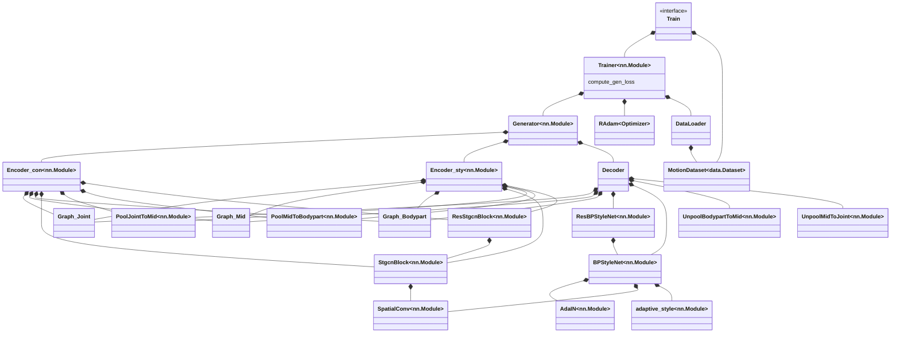

# MP-ClassDiagram
## Motoin Puzzle

```mermaid
classDiagram

  class Train{
    <<interface>>
  }
  class Trainer ~nn.Module~　{compute_gen_loss}
  class Generator ~nn.Module~
  class Encoder_con ~nn.Module~
  class Encoder_sty ~nn.Module~
  class Graph_Joint
  class Graph_Mid
  class Graph_Bodypart
  class PoolJointToMid ~nn.Module~
  class PoolMidToBodypart ~nn.Module~
  class UnpoolBodypartToMid ~nn.Module~
  class UnpoolMidToJoint ~nn.Module~
  class StgcnBlock ~nn.Module~
  class ResStgcnBlock ~nn.Module~
  class BPStyleNet ~nn.Module~
  class ResBPStyleNet ~nn.Module~
  class SpatialConv ~nn.Module~
  class adaptive_style ~nn.Module~
  class AdaIN ~nn.Module~
  class RAdam ~Optimizer~
  class MotionDataset ~data.Dataset~
  clasee DataLoader

  Train *-- Trainer
  Train *-- MotionDataset
  Trainer *-- Generator
  Trainer *-- RAdam
  Trainer *-- DataLoader
  DataLoader *-- MotionDataset
  Generator *-- Encoder_con
  Generator *-- Encoder_sty
  Generator *-- Decoder
  Encoder_con *-- Graph_Joint
  Encoder_con *-- Graph_Mid
  Encoder_con *-- Graph_Bodypart
  Encoder_con *-- StgcnBlock
  Encoder_con *-- PoolJointToMid
  Encoder_con *-- PoolMidToBodypart
  Encoder_con *-- ResStgcnBlock
  Encoder_sty *-- Graph_Joint
  Encoder_sty *-- Graph_Mid
  Encoder_sty *-- Graph_Bodypart
  Encoder_sty *-- StgcnBlock
  Encoder_sty *-- PoolJointToMid
  Encoder_sty *-- PoolMidToBodypart
  Encoder_sty *-- ResStgcnBlock
  Decoder *-- Graph_Joint
  Decoder *-- Graph_Mid
  Decoder *-- Graph_Bodypart
  Decoder *-- ResBPStyleNet
  Decoder *-- BPStyleNet
  Decoder *-- UnpoolBodypartToMid
  Decoder *-- UnpoolMidToJoint
  BPStyleNet *-- AdaIN
  BPStyleNet *-- SpatialConv
  BPStyleNet *-- adaptive_style
  ResBPStyleNet *-- BPStyleNet
  ResStgcnBlock *-- StgcnBlock
  StgcnBlock *-- SpatialConv
```

